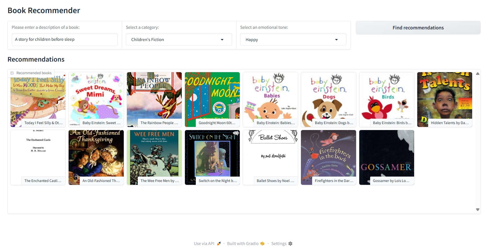

# 📚 AI-Powered Book Recommender

This project is an intelligent book recommendation system that suggests books to users based on their natural language queries. It leverages a combination of semantic search, genre classification, and sentiment analysis to provide personalized recommendations. The user interface is a web-based dashboard created with Gradio.


The entire project was developed using Kaggle notebooks.

---

## 🚀 Features

* **Semantic Search**: Understands the user's query and finds books with similar descriptions using vector similarity search.
* **Genre Filtering**: Allows users to narrow down recommendations by genre (e.g., Fiction, Nonfiction, Children's Fiction).
* **Emotional Tone Filtering**: Enables users to select a desired emotional tone for the book (e.g., Happy, Sad, Suspenseful).
* **Interactive UI**: A simple and intuitive web interface for easy interaction.

---

## 🛠️ How It Works

The project follows a multi-stage pipeline to deliver recommendations:

1.  **Data Cleaning & Preparation**: The initial dataset of over 6,800 books was cleaned to handle missing values. Only books with descriptions of at least 25 words were retained.
2.  **Genre Classification**: A zero-shot classification model (`facebook/bart-large-mnli`) was used to classify books into genres like Fiction and Nonfiction for books that were missing this information.
3.  **Sentiment Analysis**: An emotion detection model (`j-hartmann/emotion-english-distilroberta-base`) analyzed the book descriptions to score them on emotions such as joy, sadness, fear, and surprise.
4.  **Vector Embeddings & Indexing**: Book descriptions were converted into vector embeddings using the `all-MiniLM-L6-v2` model. These embeddings were then indexed using **Facebook AI Similarity Search (FAISS)** to enable efficient similarity searches.
5.  **Gradio User Interface**: A user-friendly dashboard was built with Gradio to bring all the features together, allowing users to input queries and apply filters to get tailored book recommendations.

---

## 💻 Installation and Setup

To run this project locally, follow these steps:

1.  **Clone the repository:**
    ```bash
    git clone https://github.com/kannoun/AI-Powered-Book-Recommender
    cd AI-Powered-Book-Recommender
    ```

2.  **Install the required libraries:**
    It is recommended to use a virtual environment.
    ```bash
    pip install pandas numpy sentence-transformers faiss-cpu scikit-learn gradio transformers torch
    ```
    *Note: For GPU support with FAISS and PyTorch, you will need a compatible NVIDIA GPU and CUDA installed. The `faiss-gpu` package can be used instead of `faiss-cpu`.*

3.  **Download Pre-computed Files**:
    You will need the FAISS index and the metadata files that were generated. Make sure you have the following files in your project directory:
    * `book_faiss_index.index`
    * `book_metadata.json`
    * `books_with_emotions_categories.csv` (This is the final dataset after processing in `sentiment-analysis.ipynb` and `text_classification.ipynb`)

4.  **Run the Gradio application:**
    ```bash
    python gradio_dashboard.py
    ```
    The application will be available at a local URL (e.g., `http://127.0.0.1:7860`).

### 🚀 Live Demo on Hugging Face Spaces

You can try out the book recommender live without any installation! The project is hosted as a public Space on Hugging Face.

[](https://huggingface.co/spaces/KANNOUN/AI-Powered-Book-Recommender)

### Screenshots


